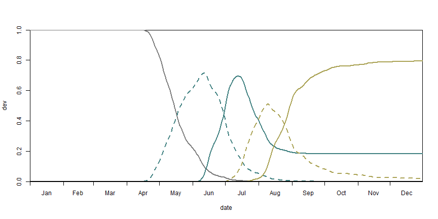
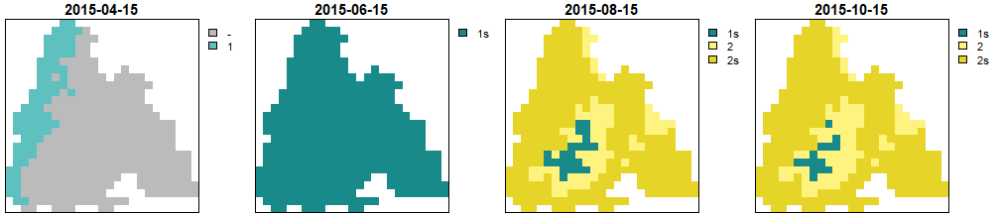

BSO works structurally differently than the other models in this package. It
stochastically simulates a multitude of individuals instead of only returning a result for
one representative beetle. Additionally, it requires an hourly onset to function. This is why
the BSO-specific phenology function `bso_phenology()` exists. While it is still
possible to combine the diapause and the mortality submodels with other models,
this is not the case for the onset and development submodels.


``` r

library(barrks)
library(tidyverse)
library(terra)


# function to unify the appearance of raster plots
my_rst_plot <- function(rst) {
  plot(rst, mar = c(0.2, 0.1, 2, 5),
       axes = FALSE, box = TRUE, nr = 1,
       cex.main = 1.9, plg = list(cex = 1.8))
}


pheno_bso <- bso_phenology('bso', barrks_data())
```


# BSO-specific plots

As `bso_phenology()` returns a more detailed result than `phenology()`, a few
more functions are available for illustration.
The stage diagram illustrates the share of the total individuals
at a specific developmental stage.


``` r

station <- stations_create('station 1', 234)

bso_plot_stage_diagram(pheno_bso, station)
```

<div class="figure">

<p class="caption">BSO stage diagram (the different colors represent the respective generation, generation '0' stands for the hibernating beetles)</p>
</div>

The flight diagram shows the relative flight activity at a specific date.


``` r
bso_plot_flight_diagram(pheno_bso, station)
```

<div class="figure">

<p class="caption">BSO flight diagram (the colors describe which generation flies to establish a new filial generation or a sister brood respectively)</p>
</div>


# Standard outputs

With `bso_translate_phenology()` it is possible to translate the BSO-specific
phenology to a form that corresponds to the output of `phenology()`.
This makes it possible to use functions that are available to analyse phenology
objects.


``` r

pheno_translated <- bso_translate_phenology(pheno_bso)

dates <- c('2015-04-15', '2015-06-15', '2015-08-15', '2015-10-15')
get_generations_rst(pheno_translated, dates) %>% my_rst_plot()
```

<div class="figure">

<p class="caption">Generations calculated by BSO</p>
</div>


