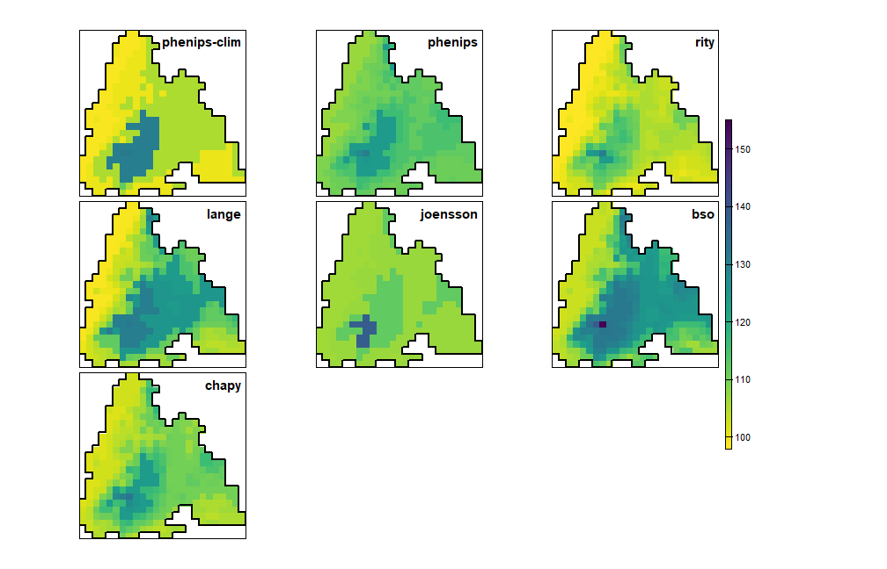
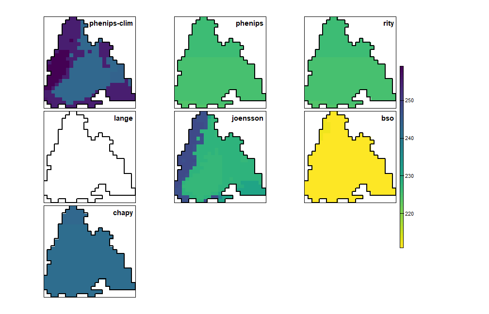
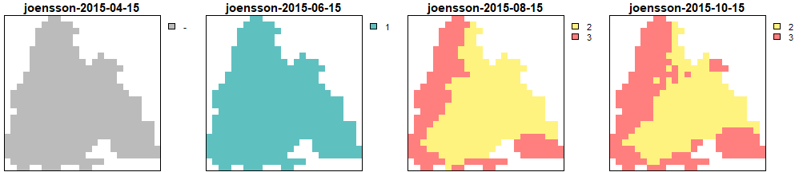
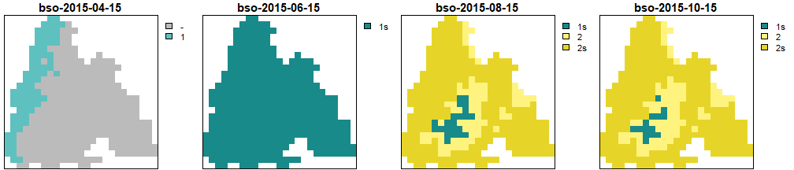
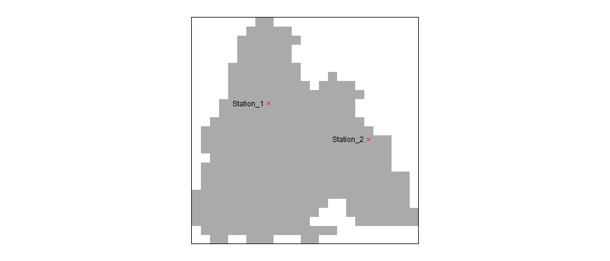
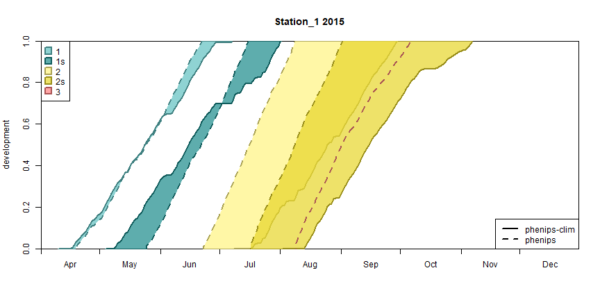
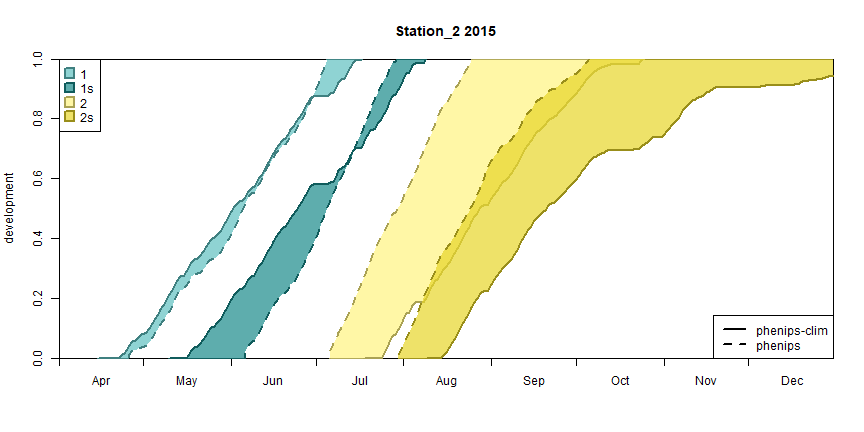

``` r

library(barrks)
library(tidyverse)
library(terra)


# function to unify the appearance of raster plots
my_rst_plot <- function(rst, ...) {
  plot(rst, mar = c(0.2, 0.1, 2, 5),
       axes = FALSE, box = TRUE, nr = 1,
       cex.main = 1.9, plg = list(cex = 1.8), ...)
}
```

# Calculate phenology

In this vignette, the sample data delivered with `barrks` is used to calculate the
phenology with all models available in the package. Note that the daylength threshold
for diapause initiation of the Jönsson model is adapted to Central Europe from @Baier2007.


``` r

data <- barrks_data()

# calculate phenology
phenos <- list('phenips-clim' = phenology('phenips-clim', data),
               'phenips' = phenology('phenips', data),
               'rity' = phenology('rity', data),
               'lange' = phenology('lange', data),
               # customize the Jönsson model for Central Europe
               'joensson' = phenology(model('joensson', daylength_dia = 14.5), data),
               'bso' = bso_phenology(.data = data) %>% bso_translate_phenology(),
               'chapy' = phenology('chapy', data))
```


# Spatial outputs

`barrks` provides different functions to examine the results of the phenology
calculations. This section describes the application of the basic functions that
return spatial outputs.


## Day-of-year-rasters

The onset of infestation, initiation of diapause and the frost-induced mortality
are described as the corresponding day of year. That data can be attained via
`get_onset_rst()`, `get_diapause_rst()` or `get_mortality_rst()`.
As some models have not all submodels implemented and `terra::panel()` does not
allow adding empty rasters, a workaround-function is defined to plot the
the respective submodel outputs.
Additionally it draws the borders of the area of interest.


``` r


plot_doy_panel <- function(x) {

  aoi <- as.polygons(data[[1]][[1]] * 0)

  draw_aoi_borders <- function(i) {

    if(empty[i]) polys(aoi, lwd = 2, col = 'white')
    else polys(aoi, lwd = 2)
  }

  # Replace NULL by a raster with values in the overall range to not affect the legend.
  # The raster will be overplotted by `draw_aoi_borders()`
  rst_tmp <- data[[1]][[1]] * 0 + min(minmax(rast(discard(x, is.null)))[1,])
  empty <- map_lgl(x, \(y) is.null(y))
  walk(which(empty), \(i) x[[i]] <<- rst_tmp)

  panel(rast(x),
        names(x),
        col = viridisLite::viridis(100, direction = -1),
        axes = FALSE,
        box = TRUE,
        loc.main = 'topright',
        fun = draw_aoi_borders,
        cex.main = 1.9,
        plg = list(cex = 1.8))
}

plot_doy_panel(map(phenos, \(p) get_onset_rst(p)))
plot_doy_panel(map(phenos, \(p) get_diapause_rst(p)))
plot_doy_panel(map(phenos, \(p) get_mortality_rst(p)[[1]]))

```

<div class="figure">

<p class="caption">Day of year when the infestation begins</p>
</div>
<div class="figure">

<p class="caption">Day of year when the diapause begins (in white cells no diapause was induced)</p>
</div>
<div class="figure">

<p class="caption">Day of year of the first frost-induced mortality event in autumn (in white cells no mortality happened)</p>
</div>


## Generations

To get an overview of the establishment of generations, it is possible
to plot the prevailing generations on different dates using
`get_generations_rst()` and `my_rst_plot()`.


``` r

# dates to plot
dates <- c('2015-04-15', '2015-06-15', '2015-08-15', '2015-10-15')

# walk through all phenology models
walk(names(phenos), \(key) {

  p <- phenos[[key]]

  # plot generations of current model
  get_generations_rst(p, dates) %>% my_rst_plot(main = paste0(key, '-', dates))
})
```

<div class="figure">

<p class="caption">Generations calculated by PHENIPS-CLIM</p>
</div>
<div class="figure">

<p class="caption">Generations calculated by PHENIPS</p>
</div>
<div class="figure">

<p class="caption">Generations calculated by RITY</p>
</div>
<div class="figure">

<p class="caption">Generations calculated by the Lange model</p>
</div>
<div class="figure">

<p class="caption">Generations calculated by the Jönsson model</p>
</div>
<div class="figure">

<p class="caption">Generations calculated by the BSO model</p>
</div>
<div class="figure">

<p class="caption">Generations calculated by CHAPY</p>
</div>


# Stationwise outputs

To plot the development diagrams of particular raster cells, stations can be
defined by specifying their cell numbers.
To get the stations' coordinates, `terra::xyFromCell` can be used.


``` r

# plot the locations of the stations

rst_aoi <- data[[1]][[1]] * 0
stations <- c(Station_1 = 234, Station_2 = 345)
station_coords <- vect(xyFromCell(rst_aoi, stations))

plot(rst_aoi,  col = '#AAAAAA', legend = FALSE, axes = FALSE, box = TRUE)
plot(station_coords, col = 'red', pch = 4, add = TRUE)
text(station_coords, names(stations), col = 'black', pos = 2)
```
<div class="figure">

<p class="caption">Stations map</p>
</div>

The stations should be passed to `plot_development_diagram()` to get the desired plots.
Here, only the models PHENIPS-Clim and PHENIPS are plotted to reduce the complexity
of the diagrams.


``` r
# plot the development diagrams

limits <- as.Date(c('2015-04-01', '2015-12-31'))

models <- c('phenips-clim', 'phenips')

walk(1:length(stations), \(i) {
  plot_development_diagram(phenos[models],
                           stations[i],
                           .lty = 1:length(models),
                           xlim = limits)
})
```
<div class="figure">

<p class="caption">Development diagram for station 1</p>
</div>
<div class="figure">

<p class="caption">Development diagram for station 2</p>
</div>

