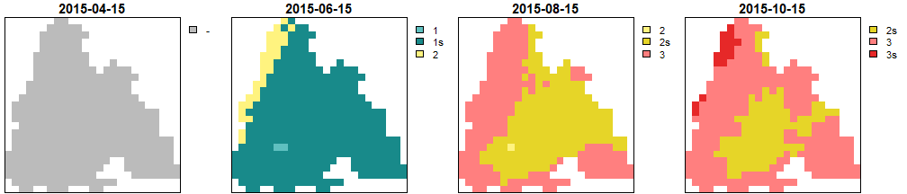
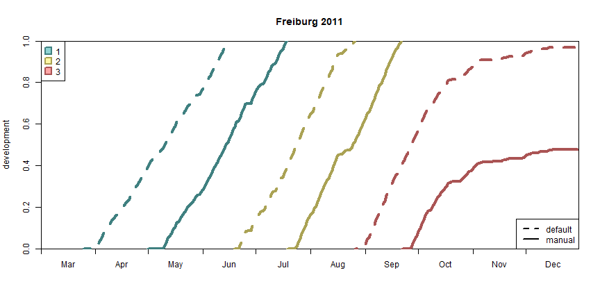

`barrks` offers two ways of model customization. The parameters of a model can
be modified and individual submodels can be combined to create a new model.
Furthermore, it is possible to create phenological events (such as onset,
diapause and mortality) manually to apply a model with observed or
arbitrary data. This vignette illustrates the corresponding procedures and
compares the respective outputs with an unmodified model.


``` r

library(barrks)
library(tidyverse)
library(terra)


# function to unify the appearance of raster plots
my_rst_plot <- function(rst) {
  plot(rst, mar = c(0.2, 0.1, 2, 5),
       axes = FALSE, box = TRUE, nr = 1,
       cex.main = 1.9, plg = list(cex = 1.8))
}


data <- barrks_data()

# calculate phenology without modification for comparison
pheno_std <- phenology('phenips', data)
```

# Customize and combine models

To modify parameters of individual models the new values should be passed to
`model()`. In this sample PHENIPS is customized by
setting the daylength threshold for the diapause submodel to 14 hours. The
parameters available for customization are found on the model customization manuals
which are listed at the `model()` manual.

To combine individual submodels, `model_combine()` is used. As parameters, the
individual models are listed. To combine a model with a specific submodel, pass a list
with the keys `model` and `submodels`.
In the sample PHENIPS is combined with the
diapause submodel of PHENIPS-Clim.

To compare the model outputs, the prevailing generations for all calculated
models are plotted on four different dates.


``` r

# calculate phenology with a customized model
model_custom <- model('phenips', daylength_dia = 14)
pheno_custom <- phenology(model_custom, data)

# calculate phenology with a combined model
model_combined <- model_combine('phenips',
                                list(model = 'phenips-clim',
                                     submodels = 'diapause'))
pheno_combined <- phenology(model_combined, data)

# plot generations
dates <- c('2015-04-15', '2015-06-15', '2015-08-15', '2015-10-15')
get_generations_rst(pheno_std, dates) %>% my_rst_plot()
get_generations_rst(pheno_custom, dates) %>% my_rst_plot()
get_generations_rst(pheno_combined, dates) %>% my_rst_plot()

```

<div class="figure">

<p class="caption">Generations calculated by PHENIPS without modifications</p>
</div>
<div class="figure">

<p class="caption">Generations calculated by customized PHENIPS</p>
</div>
<div class="figure">

<p class="caption">Generations calculated by PHENIPS combined with diapause submodel of PHENIPS-Clim</p>
</div>


# Create onset, diapause or mortality events manually

To create phenological events  manually, `create_onset()`, `create_diapause()` and
`create_mortality()` are used. These functions return multi-layer SpatRasters that can be used as
`.onset`, `.diapause` or `.mortality` parameter for `phenology()`. For instance,
this practice can be used to implement personal observations.

As an example, PHENIPS-Clim is applied on the station data delivered with `barrks` and
the onset is set to May 1st. The results are plotted in a development diagram
without sister broods to keep it simple.


``` r

# calculate phenology without modification for comparison
pheno_std <- phenology('phenips-clim', barrks_data('stations'))

# calculate phenology with a manually created onset
onset <- create_onset(barrks_data('stations'), c(Freiburg = yday('2011-05-01')))
pheno_manual <- phenology('phenips-clim', barrks_data('stations'), .onset = onset)

# plot for comparison
plot_development_diagram(list(default = pheno_std, manual = pheno_manual),
                         xlim = as.Date(c('2011-03-01', '2011-12-31')),
                         .generations = prop_filial_generations(pheno_std),
                         .lty = c(2, 1),
                         .lwd = 4,
                         .legend_lty = list(lwd = 2),
                         .group = FALSE)
```

<div class="figure">

<p class="caption">Development diagram of PHENIPS with and manually created onset</p>
</div>


